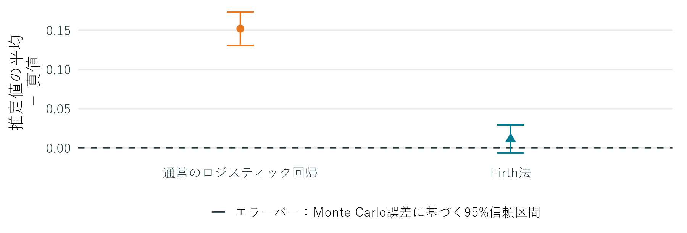
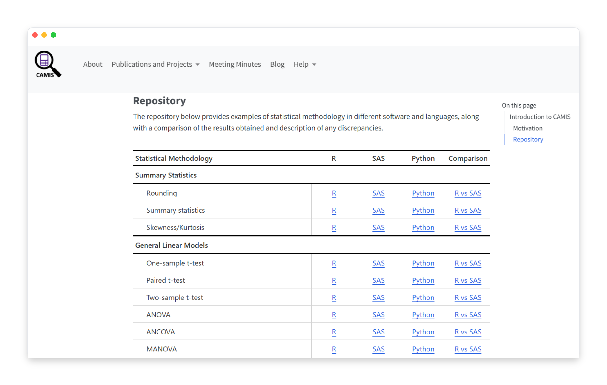
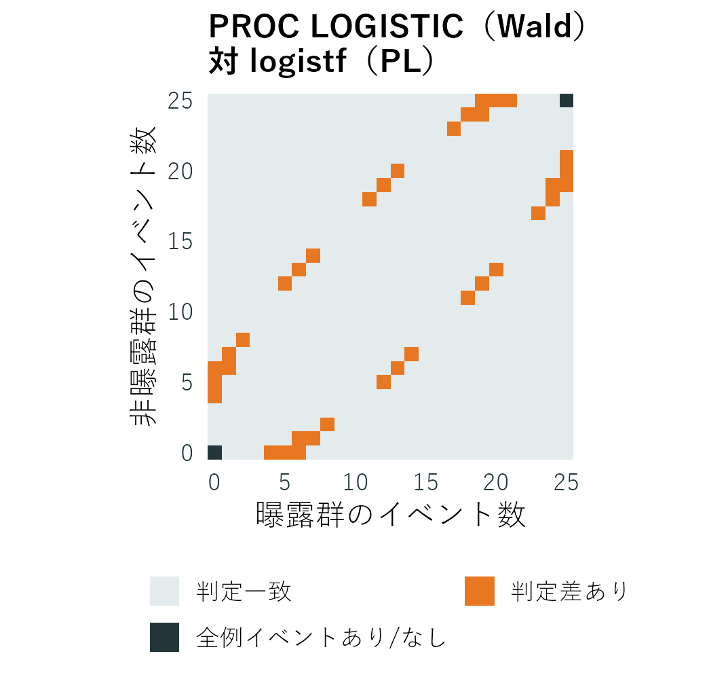
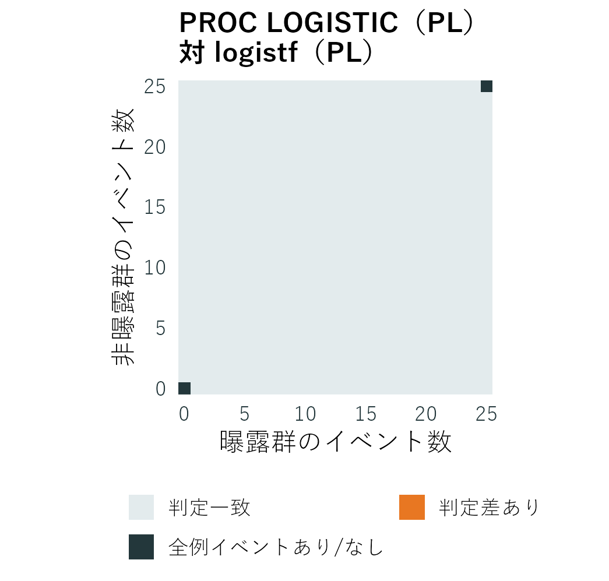
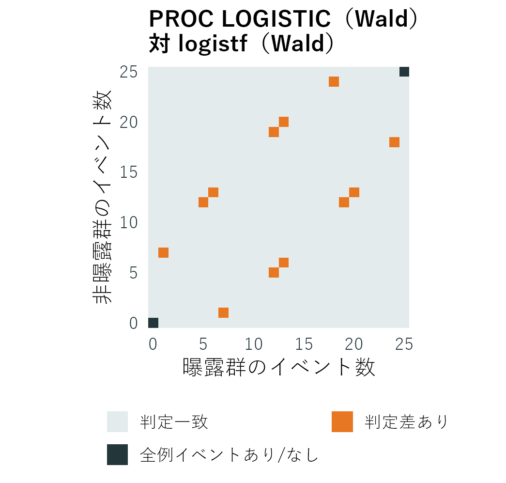
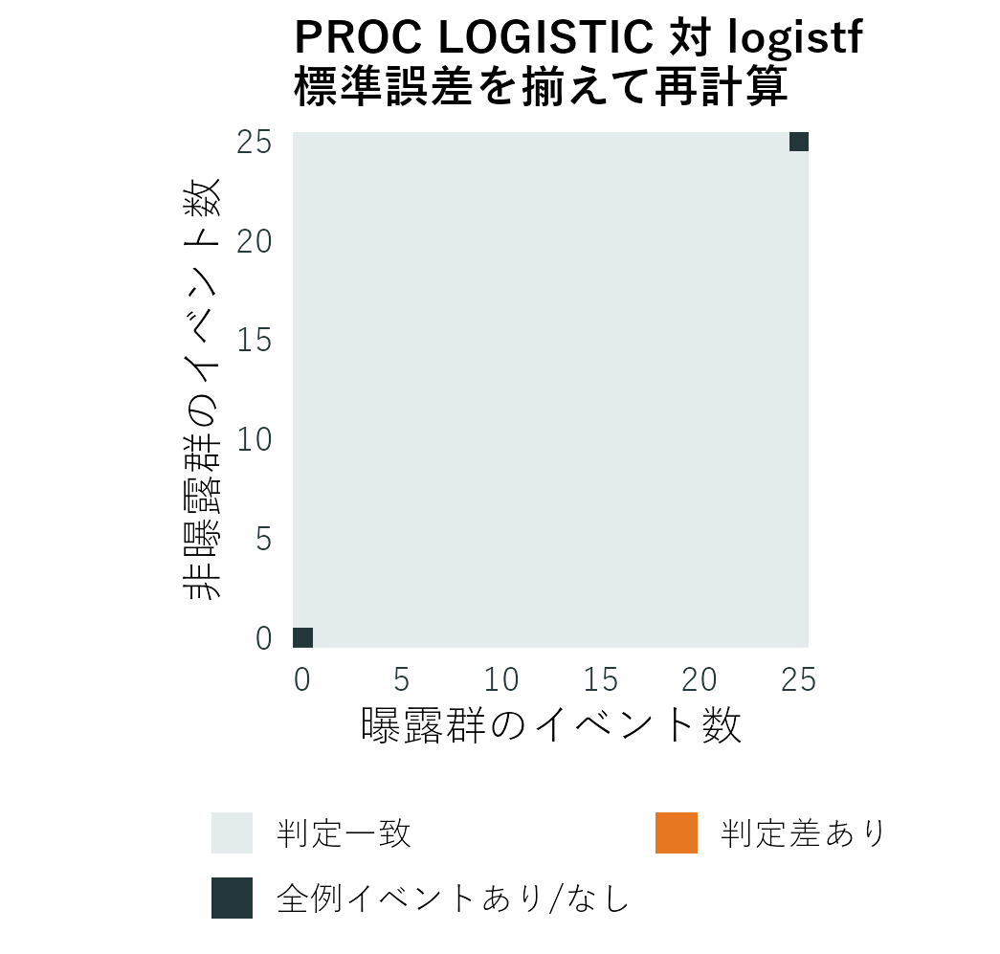
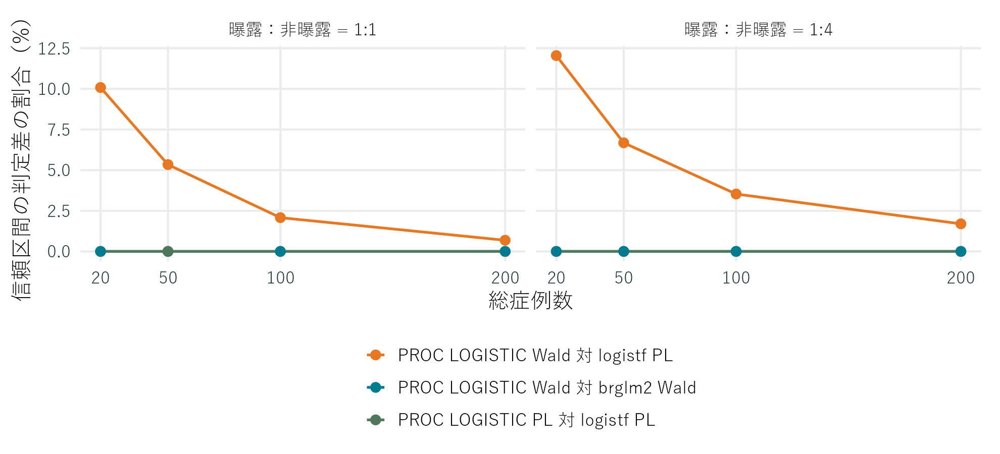
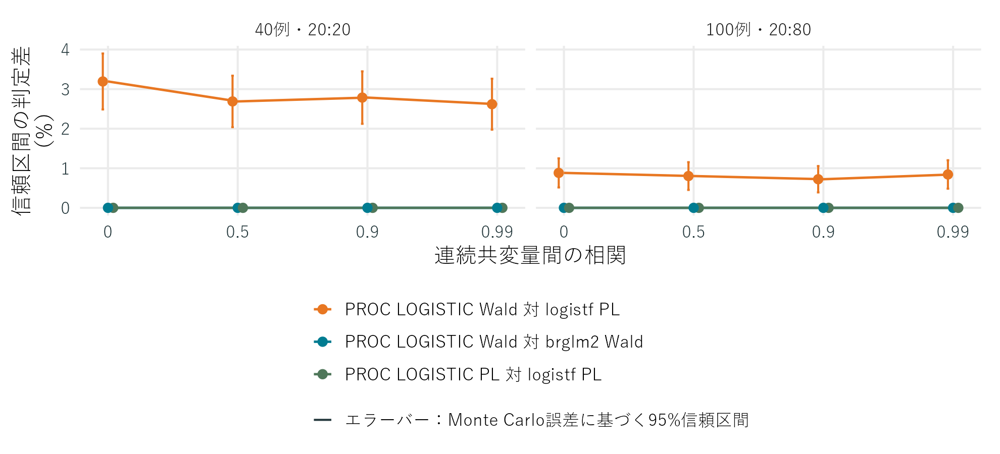
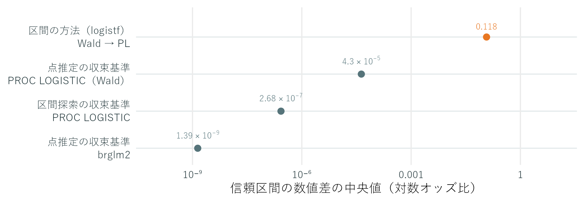

```{=typst}
#import "tables.typ": presentation-table, contingency-table
```

## Disclaimer

本プレゼンテーションで述べられている見解および意見は発表者個人のものであり、その他の個人または組織の見解や意見を反映するものではありません。

## 本日お話しすること

**同じFirth法でも、SASとRで結果が異なるのはなぜか**

まず、各実装の計算方法を確認する

次に、結果にどの程度影響するかを小標本のデータを用いた数値実験で評価する

# 背景・目的

## 完全分離と準完全分離

分離と呼ばれる状況では、ロジスティック回帰で推定値を求めることができない。

:::: {.columns}
::: {.column width="1fr"}

**完全分離**

```{=typst}
#contingency-table(
  ((1, 0), (0, 19)),
  row-label: [曝露], column-label: [イベント],
  row-levels: ([あり], [なし]),
  column-levels: ([あり], [なし]),
)
```

**イベント有無が2群で分かれている。**

:::
::: {.column width="1fr"}

**準完全分離**

```{=typst}
#contingency-table(
  ((1, 19), (0, 20)),
  row-label: [曝露], column-label: [イベント],
  row-levels: ([あり], [なし]),
  column-levels: ([あり], [なし]),
)
```

**イベントが曝露群にのみ存在**

:::
::::

いずれも回帰係数が発散し、有限の最尤推定値が得られない。

[[Existence of Maximum Likelihood Estimates](https://support.sas.com/documentation/cdl/en/statug/65328/HTML/default/statug_logistic_details10.htm); [Heinze & Schemper (2002)](https://doi.org/10.1002/sim.1047)]{.small-cite}

## Firth法

**小標本での推定のバイアスを低減し、分離下でも有限の回帰係数を求める方法**

$$
\ell_F(\beta)=\ell(\beta)+\frac{1}{2}\log|I(\beta)|
$$

$\ell$：通常の対数尤度、$I$：Fisher情報行列

- 罰則付き対数尤度 $\ell_F$ を最大化する
- モデル行列がフルランクなら、分離下でも有限の推定値が得られる

[[Firth (1993)](https://doi.org/10.1093/biomet/80.1.27); [Kosmidis & Firth (2021)](https://doi.org/10.1093/biomet/asaa052)]{.small-cite}

## Firth法によるバイアス低減の例

60例、説明変数3個、真の係数1、シミュレーション2000回とし、\
通常のロジスティック回帰とFirth法を比較

{width=82% fig-align="center"}

Firth法によってバイアスが解消されていることがわかる。

[[Kosmidis & Firth (2021)](https://doi.org/10.1093/biomet/asaa052)]{.small-cite}

## Firth法の信頼区間と検定

Wald法、またはプロファイル罰則付き尤度（PL）に基づく方法を用いる。

:::: {.columns}
::: {.column width="1fr"}

**Wald法**

$$Z=\frac{\hat\beta}{\mathrm{SE}}$$

信頼区間：$\hat\beta\pm z_{1-\alpha/2}\,\mathrm{SE}$

検定：$|Z|>z_{1-\alpha/2}$ なら棄却

:::
::: {.column width="1fr"}

**PL区間・罰則付き尤度比検定（PLRT）**

$$\mathrm{LR}=2(\ell_{F,\mathrm{full}}-\ell_{F,\mathrm{restricted}})$$

$\ell_F$：罰則付き対数尤度

- full：全係数を推定
- restricted：$\beta$ を固定して他を再推定

信頼区間：$\mathrm{LR}\le\chi^2_{1,\,1-\alpha}$ となる範囲

検定：$\beta=0$ での $\mathrm{LR}>\chi^2_{1,\,1-\alpha}$ なら棄却

:::
::::

[[logistf](https://cran.r-project.org/web/packages/logistf/logistf.pdf)]{.small-cite}

## SAS・RでFirth法を使うには

SASではPROC LOGISTICのFIRTHオプションや%FLマクロ、\
Rではパッケージが用意されている。

```{=typst}
#presentation-table(
  (0.5fr, 1fr, 2.8fr),
  table.header([言語], [形態], [名称]),
  [SAS], [プロシジャ], [`PROC LOGISTIC`],
  [SAS], [公開マクロ], [`%FL` (georgheinze/flicflac)],
  [R], [パッケージ], [logistf],
  [R], [パッケージ], [brglm2],
)
```

[[MODEL Statement](https://support.sas.com/documentation/cdl/en/statug/68162/HTML/default/statug_logistic_syntax22.htm); [flicflac](https://github.com/georgheinze/flicflac); [logistf](https://cran.r-project.org/web/packages/logistf/logistf.pdf); [brglm2](https://cran.r-project.org/web/packages/brglm2/brglm2.pdf)]{.small-cite}

## CAMISとは

{width=8%} **CAMIS：Comparing Analysis Method Implementations in Software**

SAS・Rにおける各統計手法の実装差を比較・検証するワーキンググループ

{width=48% fig-align="center"}

[[CAMIS - A PHUSE DVOST Working Group](https://psiaims.github.io/CAMIS/)]{.small-cite}

## CAMISの報告：Firth法の実装差と数値比較

CAMISでは、SAS PROC LOGISTICとR logistfの実装差と実行結果を比較している。

- 既定では信頼区間・検定・計算アルゴリズム・収束設定も異なる。
- 両実装をPL区間で揃え、`survival::lung` データを用いて解析すると、各共変量の点推定値・95%信頼区間は小数第3位まで一致した。
- 一方、ageの標準誤差やp値では出力結果の数値に差があった。

[[R vs SAS: Logistic Regression](https://psiaims.github.io/CAMIS/Comp/r-sas_logistic-regr.html#firth-logistic-regression-1)]{.small-cite}

## 本発表の動機・目的

- CAMISの報告では、分離への対処を必要としないデータを用いている。
- 分離が生じやすい小標本では、信頼区間・検定・最適化・収束基準の違いが結果に大きく影響する可能性がある。

**小標本・少数イベントの状況で、SASとRの実装差が結果の違いにどの程度影響するかを評価する。**

# 実装の違いの整理

## 信頼区間・検定の設定

```{=typst}
#presentation-table(
  (1.5fr, 1.2fr, 1fr, 1.8fr),
  table.header([実装], [既定の信頼区間], [既定の検定], [切り替え方法]),
  [SAS \ PROC LOGISTIC], [`CLPARM`で指定], [Wald検定], [p値は変更不可],
  [SAS %FL], [PL区間], [PLRT], [`pl`でWald区間・検定],
  [R logistf], [PL区間], [PLRT], [`pl`でWald区間・検定],
  [R brglm2], [Wald区間], [Wald検定], [変更不可],
)
```

[[MODEL Statement](https://support.sas.com/documentation/cdl/en/statug/68162/HTML/default/statug_logistic_syntax22.htm); [logistf](https://cran.r-project.org/web/packages/logistf/logistf.pdf); [brglm2](https://cran.r-project.org/web/packages/brglm2/brglm2.pdf); [LogisticRegression/fl.sas](https://github.com/georgheinze/flicflac/blob/master/LogisticRegression/fl.sas)]{.small-cite}

## 標準誤差の計算方法

PROC LOGISTIC・%FL・brglm2では、通常の情報行列を使う。

$$I=\sum_i w_i x_i x_i^{\mathsf T},\qquad \hat V=I^{-1}$$

logistfでは、補助重みを加えた情報行列を使う。

$$I_{\mathrm{aug}}=\sum_i w_i(1+h_i)x_i x_i^{\mathsf T},\qquad
\hat V=I_{\mathrm{aug}}^{-1}$$

$w_i=\hat p_i(1-\hat p_i)$、$\hat p_i$：推定確率

$x_i$：説明変数ベクトル、$\hat V$：分散共分散行列

$h_i=w_i x_i^{\mathsf T}I^{-1}x_i$：観測$i$の当てはめへの影響度

[[Iterative Algorithms for Model Fitting](https://support.sas.com/documentation/cdl/en/statug/68162/HTML/default/statug_logistic_details05.htm); [logistf C source](https://github.com/cran/logistf/blob/master/src/logistf.c)]{.small-cite}


## 点推定の計算アルゴリズムと収束基準

```{=typst}
#block[
#set text(size: 18pt)
#presentation-table(
  (1.6fr, 1.75fr, 0.85fr, 2.8fr),
  table.header([実装], [計算アルゴリズム], [反復上限], [収束基準]),
  [SAS \ PROC LOGISTIC], [Fisher scoring], [25回], [相対勾配≤10⁻⁸],
  [SAS %FL], [修正スコアに \ 基づく更新], [50回], [係数の変化量の合計≤10⁻⁴],
  [R logistf], [Newton–Raphson], [25回], [尤度変化・最大絶対スコア \ ・係数変化≤10⁻⁵],
  [R brglm2], [quasi Fisher \ scoring], [100回], [次の係数更新量の最大値\<10⁻⁶],
)
]
```

PROC LOGISTICはNewton法に切替可\
logistfはIRLS（反復再重み付き最小二乗法）に切替可\
4実装とも回数・収束基準は変更可

[[Iterative Algorithms for Model Fitting](https://support.sas.com/documentation/cdl/en/statug/68162/HTML/default/statug_logistic_details05.htm); [LogisticRegression/fl.sas](https://github.com/georgheinze/flicflac/blob/master/LogisticRegression/fl.sas); [logistf](https://cran.r-project.org/web/packages/logistf/logistf.pdf); [brglm2](https://cran.r-project.org/web/packages/brglm2/brglm2.pdf)]{.small-cite}

## サンプルコード：SAS PROC LOGISTICと%FL

:::: {.columns}
::: {.column width="1fr"}

**PROC LOGISTIC**

```sas
proc logistic data=dat;
  model y(event='1') = exposure
    / firth clparm=pl alpha=0.05;
run;
```

:::
::: {.column width="1fr"}

**%FL**

```sas
%include "fl.sas";
%fl(data=dat, y=y,
    varlist=exposure,
    pl=1, pl1=1, alpha=0.05,
    outtab=fltab);
```

:::
::::

[[MODEL Statement](https://support.sas.com/documentation/cdl/en/statug/68162/HTML/default/statug_logistic_syntax22.htm); [LogisticRegression/fl.sas](https://github.com/georgheinze/flicflac/blob/master/LogisticRegression/fl.sas)]{.small-cite}

## サンプルコード：R logistfとbrglm2

:::: {.columns}
::: {.column width="1fr"}

**logistf：PL区間・PLRT**

```r
fit_lf <- logistf::logistf(
  y ~ exposure, data = dat,
  firth = TRUE, pl = TRUE,
  alpha = 0.05)
summary(fit_lf)
```

:::
::: {.column width="1fr"}

**brglm2：Wald区間・Wald検定**

```r
fit_bg <- glm(y ~ exposure,
  data = dat, family = binomial(),
  method = brglm2::brglmFit,
  control = brglm2::brglmControl(
    type = "AS_mean"))  # Firth法を指定
summary(fit_bg)
confint(fit_bg, level = 0.95)
```

:::
::::

[[logistf](https://cran.r-project.org/web/packages/logistf/logistf.pdf); [brglm2](https://cran.r-project.org/web/packages/brglm2/brglm2.pdf)]{.small-cite}

# 数値実験の方法

## シナリオ

**1. 分割表**

- 説明変数は曝露のみの2×2表
- 総症例数20・50・100・200例、群配分1:1・1:4
- 各群のイベント数を0から動かし、2×2表で考え得るすべての組み合わせを評価

**2. 共変量モデル**

- 説明変数は曝露と連続共変量2個
- 40例（20:20）・100例（20:80）
- 非曝露群のイベント確率0.05、真のオッズ比2
- 共変量間の相関は0・0.5・0.9・0.99
- 各条件2,500回の繰り返し

## 評価指標と集計対象

異なる2つの実装に対して、判定差と数値差を指標として評価する。

```{=typst}
#presentation-table(
  (1.1fr, 1.65fr, 2.25fr),
  table.header([対象], [判定差], [数値差]),
  [95%信頼区間], [一方だけが0を含む], table.cell(inset: (x: 6pt, y: 8pt))[下限・上限の差で大きい方],
  [p値], [一方だけがp\<0.05], table.cell(inset: (x: 6pt, y: 8pt))[差の絶対値],
)
```

分割表は各組み合わせを1件、共変量モデルは各データを1件として数える。

## 設定を変更した比較

既定の設定から変更し、信頼区間・p値への影響を調べる。

```{=typst}
#presentation-table(
  (1.45fr, 3.55fr),
  table.header([設定], [変更内容]),
  [信頼区間・検定], [信頼区間：Wald区間 ↔ PL区間 \ 検定：Wald検定 ↔ PLRT],
  [計算アルゴリズム], [PROC LOGISTIC：Fisher scoring ↔ Newton法 \ logistf：Newton–Raphson ↔ IRLS],
  [点推定の収束条件], [収束基準・反復上限を変更],
  [信頼区間の収束条件], [収束基準・反復上限を変更],
)
```

## 収束判定を厳しくしたときの比較

```{=typst}
#block[
#set text(size: 18pt)
#set par(leading: 0.4em)
#presentation-table(
  (1.9fr, 3fr, 0.85fr, 1.05fr, 0.85fr, 1.05fr),
  header-rows: 2,
  table.header(
    table.cell(rowspan: 2, align: horizon)[実装],
    table.cell(rowspan: 2, align: horizon)[引数・判定する値],
    table.cell(colspan: 2, align: center)[既定],
    table.cell(colspan: 2, align: center)[厳しい数値設定],
    [閾値], [反復上限],
    [閾値], [反復上限],
  ),
  [SAS \ PROC LOGISTIC], [`GCONV`：相対勾配], [10⁻⁸], [25], [10⁻¹²], [5,000],
  [SAS %FL], [`epsilon`：係数変化の絶対値の和], [10⁻⁴], [50], [10⁻¹²], [5,000],
  [logistf 点推定], [`lconv`：対数尤度の変化 \ `gconv`：スコアの最大絶対値 \ `xconv`：係数変化の最大絶対値], [10⁻⁵], [25], [10⁻¹²], [5,000],
  [logistf PL区間], [`lconv`：目標対数尤度とのずれ \ `xconv`：係数変化の最大絶対値], [10⁻⁵], [100], [10⁻¹²], [200],
  [brglm2], [`epsilon`：次の係数更新量の \ 最大絶対値], [10⁻⁶], [100], [10⁻¹²], [5,000],
)
]
```
[[MODEL Statement](https://support.sas.com/documentation/cdl/en/statug/68162/HTML/default/statug_logistic_syntax22.htm); [logistf.control](https://search.r-project.org/CRAN/refmans/logistf/html/logistf.control.html); [logistpl.control](https://search.r-project.org/CRAN/refmans/logistf/html/logistpl.control.html)]{.small-cite}

# 結果

## 信頼区間の設定を揃えたときの結果：PL区間

各群25例で対数オッズ比の信頼区間が0を含むか判定した。

:::: {.columns}
::: {.column width="1fr"}

{width=73%}

:::
::: {.column width="1fr"}

{width=73%}

:::
::::

**今回のシナリオでは、PL区間に揃えるとすべての判定が一致した。**

[判定が異なった36表の区間の数値差：中央値 0.412 → 0.00000790（詳細はAppendix）]{.small-cite}

## 信頼区間の設定を揃えたときの結果：Wald区間

各群25例でWald区間に設定し、信頼区間が0を含むか判定した。

:::: {.columns}
::: {.column width="1fr"}

{width=68%}

:::
::: {.column width="1fr"}

{width=68%}

:::
::::

**Wald区間に揃えても、標準誤差の推定方法の違いにより判定差が残った。**\

## 総症例数を変えた結果

群配分1:1・1:4とし、総症例数を変えて比較した。

{width=75%}

**総症例数が増えるほど判定が異なった割合は低下した。**

## 群配分を変えた結果

PROC LOGISTICのWald区間 対 logistfのPL区間\
群配分1:1・1:4とし、各群の症例数を変えて比較した。

```{=typst}
#presentation-table(
  (1fr, 1.25fr, 1fr, 1.25fr, 1fr),
  table.header([総症例数], [各群の症例数 \ （1:1）], [判定差], [各群の症例数 \ （1:4）], [判定差]),
  [20例], [10対10], [10.08%], [4対16], [12.05%],
  [50例], [25対25], [5.34%], [10対40], [6.68%],
  [100例], [50対50], [2.08%], [20対80], [3.53%],
  [200例], [100対100], [0.69%], [40対160], [1.70%],
)
```

**総症例数が同じ場合、群配分1:4の方が判定差の割合は高かった。**

## 共変量モデルでの信頼区間の判定差

{width=72%}

**共変量の相関が高くなるほど判定差が増えるという傾向は見られなかった。**

## 要因別の影響：信頼区間の数値差

どの要素を変更すると差が大きくなるかの比較を行った。

{width=97%}

# 考察

## SAS・Rの各実装で異なる要素

**信頼区間・検定：** %FL・logistfはPL法とWald法を切り替えられる。brglm2はWald法である。\
PROC LOGISTICは信頼区間を変更できるが、検定はWaldのみ使用できる。

**標準誤差：** PROC LOGISTIC・%FL・brglm2は通常の情報行列、logistfは補助重みを加えた情報行列を用いる。

**計算アルゴリズム：** 実装ごとに異なる。PROC LOGISTICはNewton法、logistfはIRLSへ変更できる。

**収束判定：** 収束基準・閾値・反復回数は実装ごとに異なり、それぞれ変更できる。

[[MODEL Statement](https://support.sas.com/documentation/cdl/en/statug/68162/HTML/default/statug_logistic_syntax22.htm); [logistf](https://cran.r-project.org/web/packages/logistf/logistf.pdf); [brglm2](https://cran.r-project.org/web/packages/brglm2/brglm2.pdf); [LogisticRegression/fl.sas](https://github.com/georgheinze/flicflac/blob/master/LogisticRegression/fl.sas)]{.small-cite}

## 結論：実装差の主な要因と比較時の確認事項

- 今回の比較では、Wald法かPL法かという信頼区間・検定方式の違いが、数値差の大きな要因だった。
- Wald法に揃えても、標準誤差の計算方法の違いにより判定を変えることがあった。
- 計算アルゴリズムや収束設定にも差があり、同じ方式でも数値や収束状態が異なり得る。

**信頼区間・検定の方式を揃え、標準誤差の計算方法と、点推定・区間計算それぞれの収束設定を確認して比較する。**

# Appendix

## 判定が異なった組み合わせの数値差

各群25例で、PROC LOGISTICのWald区間とlogistfのPL区間の判定が異なった組み合わせを比較した

```{=typst}
#presentation-table(
  (2.8fr, 1fr, 1fr),
  table.header([PROC LOGISTIC 対 logistf], [中央値], [最大値]),
  [Wald区間 対 PL区間], [0.412], [1.899],
  [PL区間 対 PL区間], [0.00000790], [0.0000290],
)
```

**同じ36表で数値差は小さくなったが、完全には一致しなかった**

## 判定が異なった表の例

曝露群：25例中イベント6例、非曝露群：25例中イベント1例

```{=typst}
#presentation-table(
  (2.3fr, 2fr),
  table.header([実装], [信頼区間]),
  [PROC LOGISTIC（Wald）], [−0.214863 — 3.603990],
  [logistf（PL）], [0.019542 — 4.016196],
  [PROC LOGISTIC（PL）], [0.019526 — 4.016199],
)
```

**PL区間に揃えると下限がともに0を上回り、判定が一致した**

## 共変量モデルの生成方法

$$\operatorname{logit}(p_i)=\alpha_\rho+\log(2)\,\mathrm{exposure}_i+0.5x_{1i}+0.5x_{2i}$$

$$x_1,z\sim N(0,1),\qquad x_2=\rho x_1+\sqrt{1-\rho^2}\,z$$
